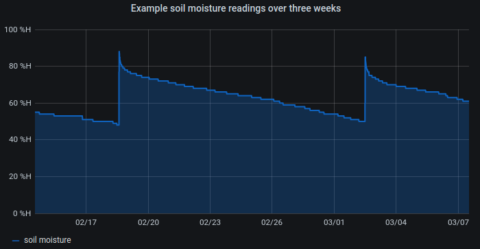
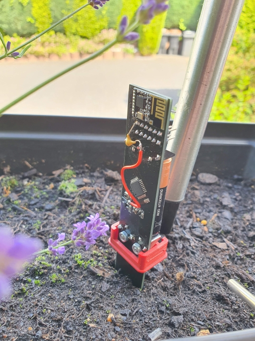
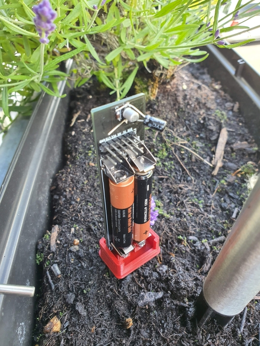

   

# Capacitive Soil Moisture Sensor

This is a capacitive soil moisture sensor which runs with a standalone ATmega328P and utilizes the [MySensors][1] framework.
It can however be adapted to any other framework that uses 2.4 GHz radio communication with a NRF24L01 if you upload your own code.

A short summary of the features is:
* Runs on 2 AAA batteries
* Sleeping current of 8uA (approx. 10 years of battery life under optimal conditions)
* Uses a NRF24L01 radio module for communication
* Utilizes an ATSHA204A for secure message signing
* A sensor value range of approximately 400 (from air to water)
* External 8MHz resonator for better temperature stability than the internal oscillator
* All SMD components (except the NRF24L01 radio) on one side of the pcb
* FTDI and AVR ISP connector for programming and bootloader burning
* 3D printable case which should make the electronics waterproof if the seam to the pcb is sealed with silicone e.g.

**Note: Take care when inserting the batteries as there is no reverse polarity protection on this board. Also check the pin assignment of the FTDI and AVR ISP headers as these might be non standard to save some space.**

## Getting Started

If you want to work on the repository you just have to run:

    git clone --recurse-submodules https://github.com/RonMcKay/capacitive-soil-moisture-sensor

The PCB design is done in KiCad 5. You are pretty much good to go if you open the project with KiCad.

For programming and burning the bootloader I use [Visual Studio Code](https://code.visualstudio.com/)
together with [PlatformIO](https://platformio.org/) and [MiniCore](https://github.com/MCUdude/MiniCore)
(which is already included in the platform io plugin for vs code).

You can generate production/documentation files and run ERC/DRC tests by running `make` in the root directory. All production files are then placed under the hardware directory. The Makefile utilizes [docker](https://www.docker.com/) containers so you should have docker installed. Note that the folders `.config/kicad` and `.cache/kicad` should already exist in your home directory.

## Contributing

I am happy to discuss and accept improvements on the project. Please make all your pull-requests on `dev`. It is also a good idea to discuss your planned changes in the [github discussion section](https://github.com/RonMcKay/capacitive-soil-moisture-sensor/discussions) to avoid unnecessary work.

# Hardware
## PCB Production
In recent years the DIY PCB industry segment has been growing and thus there are numerous options to quite easily order your boards online for low prices. Just download the Gerber-files from the [release page](https://github.com/RonMcKay/capacitive-soil-moisture-sensor/releases) or clone the repository and generate them yourself by running `make`.

## Assembly
For the assembly of your boards there are currently no SMT assembly files supplied with the release, although there are pick and place files for JLPCB generated by `make` they are not yet optimized or tested, so use them at your own risk. For manual assembly you can find the BOM attached to the release as well as a nice interactive HTML BOM which eases component placement. You only need to take care that the two battery holders which are closest to the radio module do not touch each other as this would cause a short. To be really safe you can bend them away from each other.

## Case
There is currently a 3D-printable case for the sensor with a screw on lid. In the future there might be other alternatives which require less printing time. There is also a plan to port the case design to an [openSCAD](https://openscad.org/) file but that is WIP.

# Software
## Calibration
The minimum (air) and maximum (water) sensor values need to be calibrated. For this, get a glass of water and flash the sensor with `#define CALIBRATION_MODE`. While reading out the log messages of the sensor, note down the sensor values for air and submerged in water. Change `AIR_SENSOR_VALUE` and `WATER_SENSOR_VALUE` accordingly and reflash the sensor after commenting out `#define CALIBRATION_MODE`. Your soil moisture sensor is now ready for operation.

# Future Improvements

Here is a list of possible future improvements that might be worth looking into:

* Make the sensor more compact by using a single AA/AAA battery together with a voltage booster
* Changing out the ATmega328P and the NRF24L01 for a NRF52.
* Some temperature readings of the soil would be awesome, like an SMD thermistor or something similar at the tip of the sensor.

Any contributions are highly welcome and I am happy to discuss remarks in the [github discussion section](https://github.com/RonMcKay/capacitive-soil-moisture-sensor/discussions).

# License

This project is licensed under the CERN-OHL-P v2

# Special Thanks to

* [MySensors Team][1], which made me start creating my own IoT hardware
* miceuz, for his [long writeup](https://wemakethings.net/2012/09/26/capacitance_measurement/) of how capacitive soil moisture sensing is working
* Ken Shirriff, who's post about the [secrets of arduino PWM](http://www.righto.com/2009/07/secrets-of-arduino-pwm.html) made me understand the topic to a certain extend
* Everyone out there who is producing open source hardware and/or guides explaining the topic, which makes the diy electronics topic more accessible

P.S.: The sensor on the photos is only a prototype where I accidentally soldered some wrong value capacitor and forgot a capacitor for the FTDI connector. These are however already fixed in the pcb design.

[1]: https://www.mysensors.org
